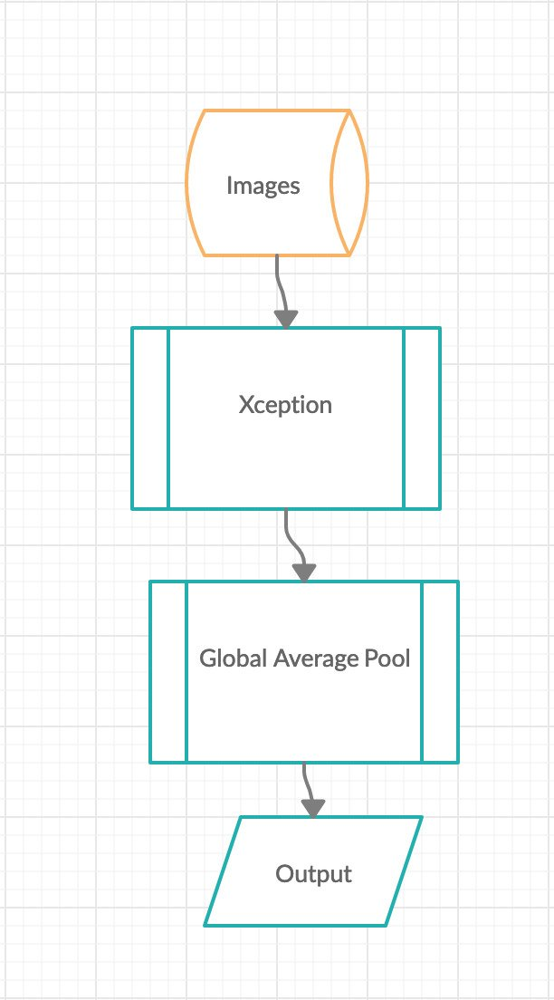
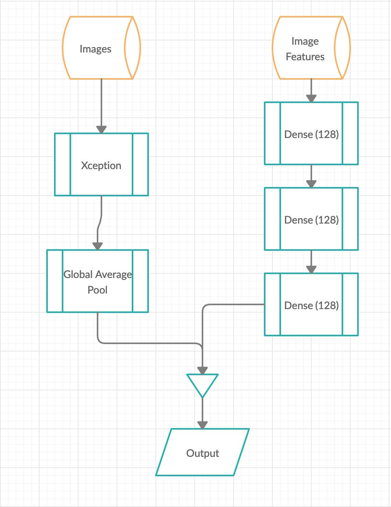

# Architecture Diagrams
>   
We currently use 2 types of model architectures. 
One of them is a simple transfer learning of pre-trained image classification model Xception with weights initialized as 'Imagenet'. The model has just a new classifier layer with sigmoid activation for binary classification. The second model shown here has a parallelised structure that deals with both image as well as features extracted from them. One branch takes up images as such through the pre-trained Xception model and the other branch takes in the sift features extracted through some dense layers. We them combine both the Xception output and the feature branch output and send it to a classifier layer with sigmoid activation.

>
##### CNN without SIFT features

##### CNN with SIFT features
